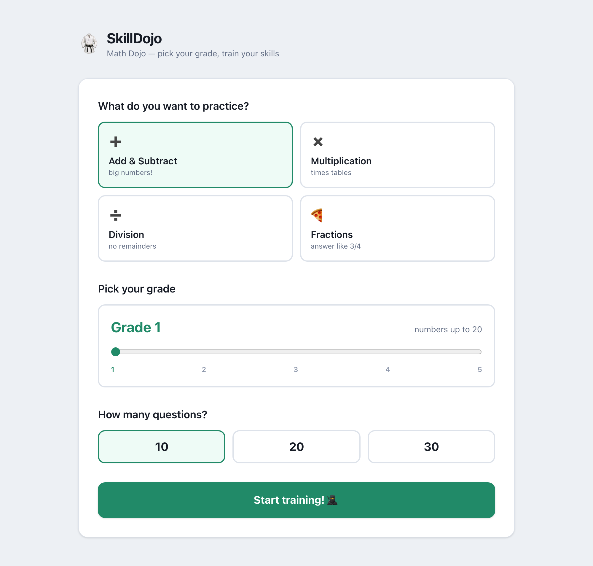

# SkillDojo 🥋

A tiny practice-sheet web app for kids. Pick what to practice, slide to your
grade level, answer the sheet, and get graded — with confetti for a perfect
score. Math is the first dojo; the code treats it as one subject so more can
be added later.

No login, no database, no accounts, no tracking. Everything lives in memory;
answers are kept server-side so peeking at the network tab doesn't help. 🙂



## Run it

Requires [Go](https://go.dev) 1.22+.

```sh
go run .        # or: make run
```

Open http://127.0.0.1:8080. `make build` produces a single self-contained
`./skilldojo` binary with all assets embedded — it works fully offline.

## Practice options

- **Add & Subtract** — multi-digit, never negative
- **Multiplication** — times tables up to 12×12 (2-digit at grade 5)
- **Division** — always divides evenly
- **Fractions** — same-denominator add/subtract, answer like `3/4`
  (equivalent fractions are accepted: `2/4` = `1/2`)

Difficulty is a **Grade 1–5 slider**, loosely following the US Common Core
progression: Grade 1 keeps addition/subtraction entirely within 20 with
halving-only division and gentle times tables; Grade 5 reaches 5-digit sums
and 2-digit multiplication. (Fractions below grade 4 are enrichment rather
than standards-aligned.) Sheets come in 10/20/30 questions.

## Play from a tablet on the same Wi-Fi

```sh
make serve      # listens on 0.0.0.0:8080
```

Find your computer's LAN IP (`ipconfig getifaddr en0` on macOS, `ipconfig` on
Windows, `hostname -I` on Linux) and open `http://<that-IP>:8080` on the
tablet. "Add to Home Screen" makes it feel like an app.

Note: `0.0.0.0` listens on every network interface the machine has, so only
run `make serve` on a trusted network (home Wi-Fi behind your router). Use
`make run` (localhost-only) everywhere else.

## Development

- Go stdlib server (`net/http`, `html/template`), Alpine.js + Tailwind CSS v4
  front end. No JS framework build step at runtime — `static/app.css` is
  committed.
- `make vet` / `make test` — the question generators are property-tested in
  `internal/sheet`.
- After changing templates or Tailwind classes: `npm install` once, then
  `make css` to rebuild `static/app.css`.
- CI runs vet, tests, build, and verifies the committed CSS is in sync.

## License

MIT — see [LICENSE](LICENSE). Alpine.js is vendored under its own MIT license
(see `static/alpine.LICENSE`).
