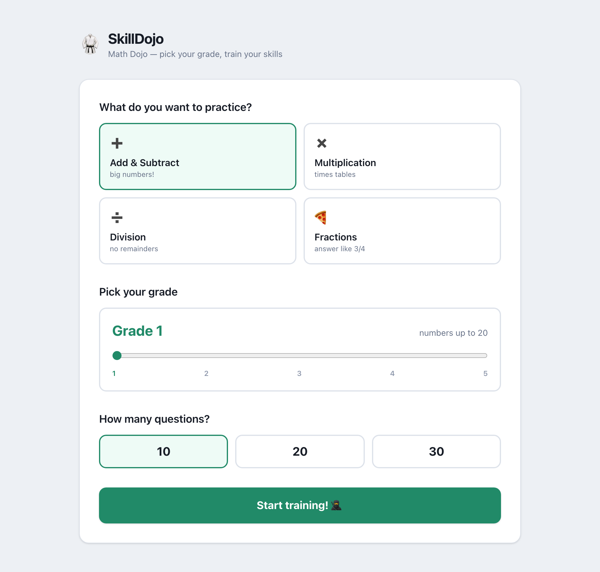

# SkillDojo 🥋

A tiny learning web app for kids. Choose a subject, slide to your grade level,
and train with quick feedback — with confetti for a perfect score. Practice
math worksheets or play Word Rescue, a friendly letter-guessing spelling game.

Practice needs no login and no account: math answers live only in server
memory and spelling words are bundled into the offline app. Parents can
optionally sign in with an email link to add nickname-only child profiles,
which is the foundation for progress and the game layer
([docs/game-layer-plan.md](docs/game-layer-plan.md)). No tracking, no ads. 🙂



## Run it

Requires [Go](https://go.dev) 1.22+.

```sh
go run .        # or: make run
```

Open http://127.0.0.1:8080. `make build` produces a single self-contained
`./skilldojo` binary with all assets embedded — it works fully offline.

`make run` starts in `-dev` mode: sign-in emails are logged instead of
sent (the link is also shown on the page), and the session cookie works over
plain http. The SQLite database defaults to `./skilldojo.db` (`-db` or
`DATABASE_PATH`); migrations apply automatically at start.

## Practice options

### Math

- **Add & Subtract** — multi-digit, never negative
- **Multiplication** — times tables up to 12×12 (2-digit at grade 5)
- **Division** — always divides evenly
- **Fractions** — same-denominator add/subtract, answer like `3/4`
  (equivalent fractions are accepted: `2/4` = `1/2`)
- **Times tables** — one table from 2 to 12, every fact from 1 to 12, in
  order or mixed up, once (12) or twice (24). Counts as multiplication
  practice for progress.

Difficulty is a **Grade 1–5 slider**, loosely following the US Common Core
progression: Grade 1 keeps addition/subtraction entirely within 20 with
halving-only division and gentle times tables; Grade 5 reaches 5-digit sums
and 2-digit multiplication. (Fractions below grade 4 are enrichment rather
than standards-aligned.) Sheets come in 10/20/30 questions.

### Spelling

**Word Rescue** is a kid-friendly hangman-style game with no grim imagery.
Players use a clue, a sentence, an optional spoken word, an on-screen letter
board, or a physical keyboard to uncover five or ten words before six lanterns
go out. The initial curriculum contains 130 pattern words across 26 spelling
focuses, plus 50 modern high-frequency sight-word entries. It progresses from
Grade 1 short vowels and consonant teams through Grade 5 roots, suffixes, and
academic vocabulary. Players can choose a focused concept, sight words, or a
smart mix. Every round ends with the answer and a short spelling lesson.

“Hear the word” uses small, pre-rendered Samantha US-English clips. Only the
current word is preloaded, and versioned clips receive a long-lived browser
cache header. Browser speech synthesis remains as a fallback if a clip cannot
play. The 176 deduplicated recordings keep playback fast on low-end devices.

The research basis, content criteria, data roadmap, and educator-review status
are documented in [docs/spelling-curriculum.md](docs/spelling-curriculum.md).

### Practice tests (parents)

Signed-in parents can start a full-length **Ohio State Test style math
practice test** (40 original questions, grades 3–5) for a child from
`/family/tests`. Answers save as the child goes, so a closed tab resumes;
attempts are unlimited. Each attempt is graded with a percent, per-category
and per-standard tallies, and an estimated Ohio performance level (Limited to
Advanced) that is a rough guide only. The parent report shows every attempt,
a score trend, and areas needing improvement that link straight to the
matching dojo drill. Items follow the published blueprint's reporting-category weights (not its
depth-of-knowledge mix) and are original, not released test questions.

## Play from a tablet on the same Wi-Fi

```sh
make serve      # listens on 0.0.0.0:8080
```

Find your computer's LAN IP (`ipconfig getifaddr en0` on macOS, `ipconfig` on
Windows, `hostname -I` on Linux) and open `http://<that-IP>:8080` on the
tablet. "Add to Home Screen" makes it feel like an app.

Parent sign-in works on the tablet too: in `-dev` mode no email is sent, so
after entering your address tap "open the sign-in link" on the page shown.

Note: `0.0.0.0` listens on every network interface the machine has, so only
run `make serve` on a trusted network (home Wi-Fi behind your router). Use
`make run` (localhost-only) everywhere else.

## Development

- Go stdlib server (`net/http`, `html/template`), Alpine.js + Tailwind CSS v4
  front end. No JS framework build step at runtime — `static/app.css` is
  committed.
- `make vet` / `make test` — the math generators and spelling game state are
  covered by automated tests.
- `make ui-test` boots the binary and drives every page in headless Chromium
  (`npx playwright install chromium` once). It fails on any page error, which
  is the only way to catch a template bound to a helper that does not exist.
- After changing templates or Tailwind classes: `npm install` once, then
  `make css` to rebuild `static/app.css`.
- The spelling curriculum lives in `internal/curriculum/spelling.json`.
  `static/words.js` is generated from it: edit the JSON, then `make words`.
  CI fails if the generated file is stale.
- On macOS, `make audio` regenerates the spelling audio set with the local
  Samantha voice. This development-only task also requires `ffmpeg`; the app
  itself has no audio dependency or runtime speech-processing cost.
- CI runs vet, tests, build, and verifies the committed CSS is in sync.

## Deploy (Fly.io)

The `Dockerfile` builds the Go binary and runs it under
[Litestream](https://litestream.io), which streams the SQLite file to an
S3-compatible bucket. `fly.toml` pins one machine with a volume at `/data`.

```sh
fly launch --no-deploy          # once; creates the app from fly.toml
fly volumes create skilldojo_data --size 1
fly secrets set RESEND_API_KEY=re_... \
  LITESTREAM_BUCKET=... LITESTREAM_ENDPOINT=https://<account>.r2.cloudflarestorage.com \
  LITESTREAM_ACCESS_KEY_ID=... LITESTREAM_SECRET_ACCESS_KEY=...
fly deploy
```

Outside `-dev` the server refuses to start unless `BASE_URL` is https,
`RESEND_API_KEY` looks like a Resend key, and `MAIL_FROM` is set. The
container refuses to start without the four Litestream secrets unless
`LITESTREAM_DISABLED=1` is set explicitly (local Docker only). It runs as an
unprivileged user after taking ownership of the volume.

## License

MIT — see [LICENSE](LICENSE). Alpine.js is vendored under its own MIT license
(see `static/alpine.LICENSE`).
